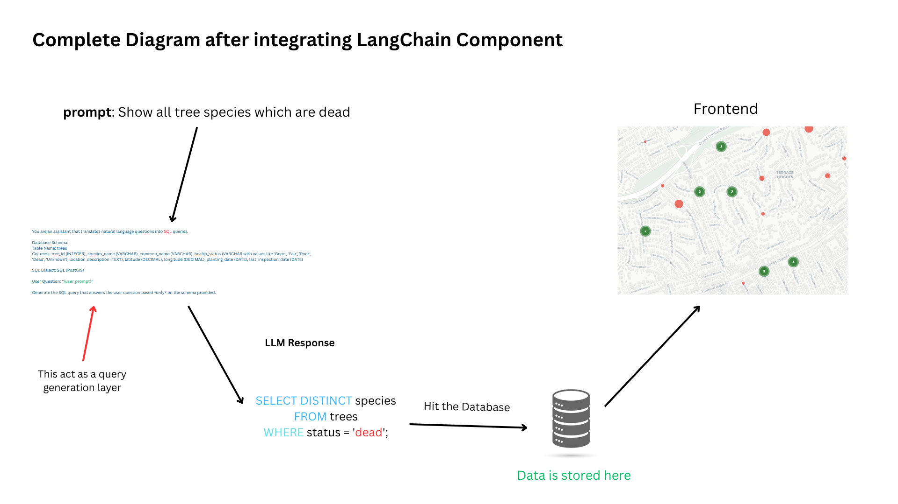
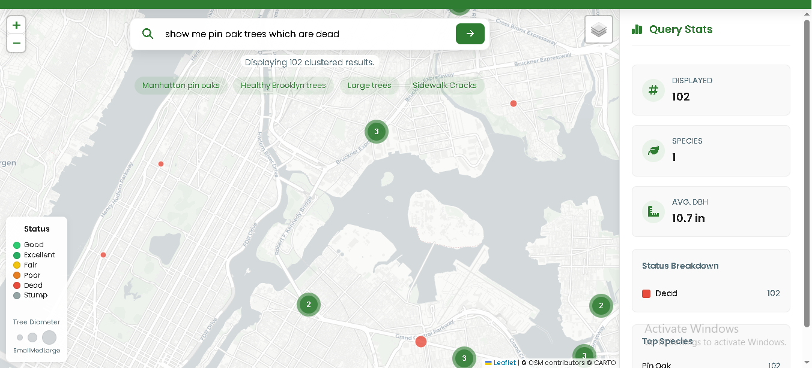

# NYC Tree Explorer

NYC Tree Explorer is a web-based application for querying and visualizing data from the 2005 NYC Tree Census. It features a Flask backend for processing natural language queries and a modern frontend built with HTML, CSS, and JavaScript for interactive map-based visualization.
## Application Workflow



## Features

- Query NYC tree data using natural language prompts (powered by Google Gemini).
- Visualize tree locations on an interactive Leaflet map with clustering.
- View statistics such as species distribution, tree health status, and average diameter.
- Responsive dashboard with charts for status breakdown and top species.
- Example queries and search suggestions for easy exploration.

## Example Output



## Prerequisites

- Python 3.8 or higher
- Node.js (optional, for advanced frontend development)
- A modern web browser
- [Visual Studio Code](https://code.visualstudio.com/) with the Live Server extension (recommended for local frontend development)
- Google Gemini API key (get one from [Google AI Studio](https://aistudio.google.com/app/apikey))

## Data

The application uses the `nyc_tree_census_2005.csv` dataset, which contains:
- Species (`spc_common`)
- Health status (`status`)
- Diameter at breast height (`tree_dbh`)
- Geographic coordinates (`latitude`, `longitude`)

## Setup & Running the Application

1. **Clone or Download the Repository**

   ```sh
   git clone <your-repo-url>
   cd NYCTrees_GPT
   ```

2. **Install Python Dependencies**

   ```sh
   pip install -r requirements.txt
   ```

3. **Set Up Environment Variables**

   - Create a `.env` file in the project root:
     ```
     GEMINI_API_KEY=your_api_key_here
     ```
   - Replace `your_api_key_here` with your actual Gemini API key.

4. **Run the Flask Backend**

   ```sh
   python app.py
   ```

   The backend will start on `http://127.0.0.1:5000/` by default.

5. **Start the Frontend**

   - Open [index.html](index.html) in Visual Studio Code.
   - Right-click and select **"Open with Live Server"** (requires the Live Server extension).
   - The app will open in your browser (usually at `http://127.0.0.1:5500/`).

## Example Queries

- "Find Good status trees."
- "Show trees over 25 inches diameter."
- "Map trees with no wire conflicts."

## Project Structure

- `app.py` — Flask backend API
- `index.html` — Main frontend HTML
- `script.js` — Frontend logic and map rendering
- `style.css` — Application styles
- `nyc_tree_census_2005.csv` — Tree census dataset
- `requirements.txt` — Python dependencies
- `.env` — Environment variables (not committed)

## Notes

- The backend uses [google-generativeai](https://pypi.org/project/google-generativeai/) for natural language query processing.
- The map uses [Leaflet](https://leafletjs.com/) and [Leaflet.markercluster](https://github.com/Leaflet/Leaflet.markercluster) for visualization.
- For best results, use the latest version of Chrome or Firefox.

---

Built with ❤️ for urban data exploration.
